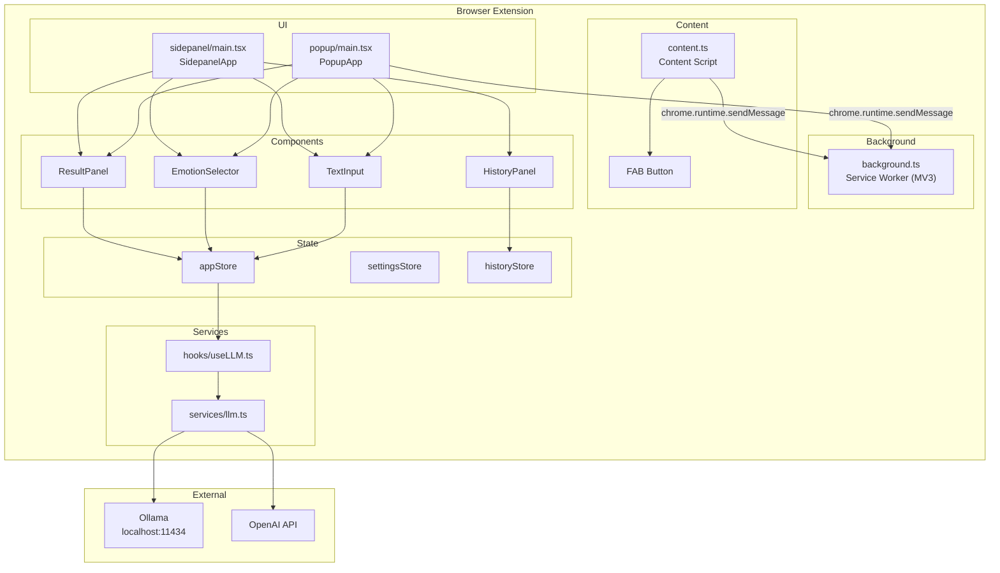
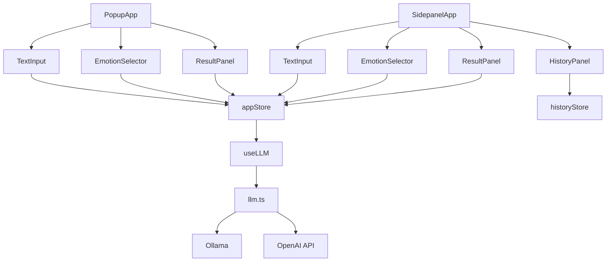
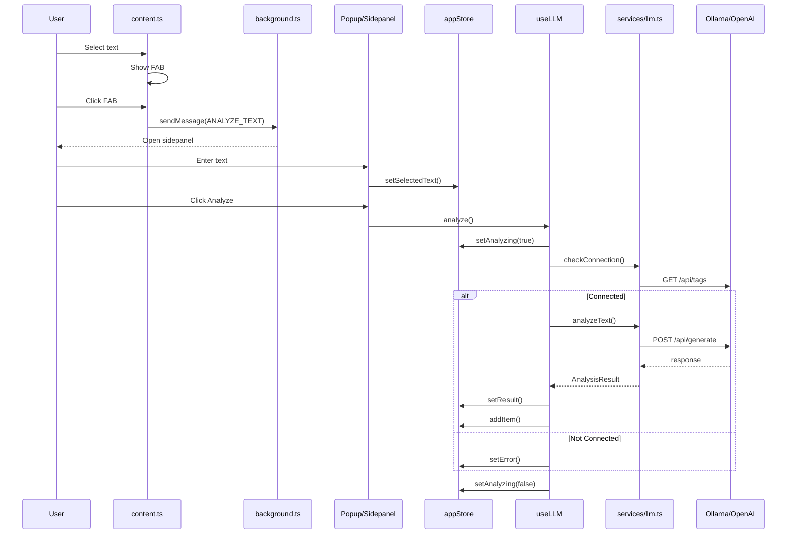
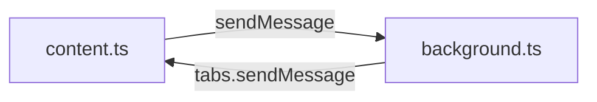

# Architecture Documentation

## System Overview



## Component Hierarchy



## Data Flow



## State Stores

```mermaid
erDiagram
    appStore {
        string selectedText
        EmotionType currentEmotion
        boolean isAnalyzing
        result null
        string error
        setSelectedText()
        setEmotion()
        setAnalyzing()
        setResult()
        setError()
        reset()
    }

    settingsStore {
        Provider provider
        string endpoint
        string apiKey
        string model
        setProvider()
        setEndpoint()
        reset()
    }

    historyStore {
        HistoryItem[] items
        addItem()
        removeItem()
        clearHistory()
        reset()
    }

    appStore --> settingsStore: getState()
    appStore --> historyStore: addItem()
```

## Message Protocol

| Action | Direction | Payload |
|--------|-----------|---------|
| ANALYZE_TEXT | content → background | `{text, emotion?}` |
| GET_SETTINGS | popup → background | `{}` |
| ANALYZE_SELECTION | background → content | `{}` |



## Tech Stack

| Layer | Technology |
|-------|------------|
| Runtime | Bun |
| Language | TypeScript strict |
| Bundler | Bun native |
| UI | React 18 |
| State | Zustand 5 |
| Extension | Manifest V3 |

---

## System Architecture

```
┌─────────────────────────────────────────────────────────────────┐
│                        Browser                                   │
│  ┌──────────────┐    ┌──────────────┐    ┌──────────────────┐   │
│  │   Popup     │    │  Side Panel  │    │  Content Script │   │
│  │   (React)   │    │   (React)    │    │  (Injected)     │   │
│  └──────┬───────┘    └──────┬───────┘    └────────┬─────────┘   │
│         │                   │                      │              │
│         └───────────────────┼──────────────────────┘              │
│                             │                                     │
│                    ┌────────▼────────┐                           │
│                    │  Message Passing │                           │
│                    └────────┬────────┘                           │
│                             │                                     │
│                    ┌────────▼────────┐                           │
│                    │   Background    │                           │
│                    │  Service Worker │                           │
│                    └────────┬────────┘                           │
└─────────────────────────────┼─────────────────────────────────────┘
                              │
                    ┌─────────▼─────────┐
                    │   LLM Service     │
                    │  ┌─────────────┐  │
                    │  │   Ollama    │  │
                    │  │ (localhost) │  │
                    │  └─────────────┘  │
                    │  ┌─────────────┐  │
                    │  │  OpenAI     │  │
                    │  │ (API)       │  │
                    │  └─────────────┘  │
                    └───────────────────┘
```

---

## Component Architecture

### 1. Content Script (`src/content/`)

**Responsibility**: Captures user-selected text and injects UI elements into web pages.

**Key Features**:

- Text selection detection
- Context menu integration
- Floating action button for quick access
- Message passing to background worker

**Public API**:

```typescript
// Types exposed to other modules
interface ContentScriptAPI {
  getSelectedText(): Promise<string>;
  showAnalysisResult(result: AnalysisResult): void;
  hideOverlay(): void;
}
```

### 2. Background Service Worker (`src/background/`)

**Responsibility**: Handles long-running tasks, manages LLM communication, coordinates between components.

**Key Features**:

- LLM API calls (Ollama/OpenAI)
- Message routing
- Storage management
- Keyboard shortcut handling

**Public API**:

```typescript
interface BackgroundAPI {
  analyzeText(text: string, emotion: EmotionType): Promise<AnalysisResult>;
  getSettings(): Promise<Settings>;
  updateSettings(settings: Partial<Settings>): Promise<void>;
}
```

### 3. Popup UI (`src/popup/`)

**Responsibility**: Quick access UI when clicking extension icon.

**Key Features**:

- Text input area
- Emotion selector
- Quick analyze button
- Recent analyses history

### 4. Side Panel (`src/sidepanel/`)

**Responsibility**: Full-featured analysis interface.

**Key Features**:

- Detailed text analysis view
- Grammar/syntax feedback display
- Tone transformation results
- History and saved suggestions

---

## Data Flow

### Flow 1: Text Analysis

```
1. User selects text on any webpage
2. Content script captures selection
3. User clicks extension icon or uses keyboard shortcut
4. Side panel/Popup opens with selected text
5. User clicks "Analyze" or selects emotion
6. UI sends message to background worker
7. Background worker calls LLM API
8. LLM returns analysis result
9. Background sends result back to UI
10. UI displays analysis/suggestions
```

### Flow 2: Tone Transformation

```
1. User has analyzed text or enters new text
2. User selects target emotion (Professional, Casual, etc.)
3. UI sends text + emotion to background worker
4. Background constructs prompt with emotion system message
5. Background calls LLM with prompt
6. LLM returns rewritten text
7. UI displays original vs transformed
8. User can copy or replace text
```

---

## State Management (Zustand)

### Stores

| Store              | Purpose                                            | Location                      |
| ------------------ | -------------------------------------------------- | ----------------------------- |
| `useAppStore`      | UI state (selected text, current emotion, loading) | `src/stores/appStore.ts`      |
| `useSettingsStore` | User preferences (LLM endpoint, default emotion)   | `src/stores/settingsStore.ts` |
| `useHistoryStore`  | Analysis history                                   | `src/stores/historyStore.ts`  |

### Persistence

- **chrome.storage.local**: Extension data (history, caches)
- **chrome.storage.sync**: User preferences (跨 device sync if user is signed in)

---

## LLM Integration

### Supported Providers

| Provider                   | Type  | Endpoint                    | Authentication |
| -------------------------- | ----- | --------------------------- | -------------- |
| Ollama                     | Local | `http://localhost:11434`    | None           |
| LM Studio                  | Local | `http://localhost:1234/v1`  | None           |
| OpenAI                     | Cloud | `https://api.openai.com/v1` | API Key        |
| Custom (OpenAI-compatible) | Both  | Configurable                | API Key        |

### Prompt System

Each emotion has a predefined system prompt:

```typescript
const EMOTION_PROMPTS = {
  professional: `You are a professional editor. Rewrite the text to be professional, clear, and business-appropriate. Maintain all factual information.`,
  casual: `You are a friendly writer. Rewrite the text in a casual, conversational tone while preserving the meaning.`,
  friendly: `You are a warm, friendly communicator. Make the text approachable and warm while staying clear.`,
  formal: `You are a formal writing expert. Rewrite with proper grammar, complex sentences, and formal vocabulary.`,
  academic: `You are an academic writer. Use scholarly language, citations format, and impersonal voice.`,
  creative: `You are a creative writer. Add creativity and flair while maintaining the core message.`,
};
```

---

## Security Considerations

1. **No Remote Code Execution**: All extension code is bundled, no eval()
2. **Minimal Permissions**: Only request what's needed
3. **Local-First**: User data stays local by default
4. **API Key Protection**: Store in chrome.storage.local, not in code
5. **CSP Compliant**: Follow Manifest V3 CSP requirements

---

## File Structure

```
src/
├── background/
│   ├── index.ts           # Entry point
│   ├── messages.ts        # Message handlers
│   └── storage.ts         # Storage utilities
├── content/
│   ├── index.ts           # Entry point
│   ├── selection.ts       # Text selection logic
│   └── overlay.ts         # Injected UI elements
├── popup/
│   ├── index.tsx          # Entry point
│   ├── App.tsx            # Main component
│   └── components/        # UI components
├── sidepanel/
│   ├── index.tsx          # Entry point
│   ├── App.tsx            # Main component
│   └── components/        # UI components
├── components/            # Shared components
│   ├── Button/
│   ├── TextInput/
│   ├── EmotionSelector/
│   └── ResultPanel/
├── hooks/                 # Custom hooks
│   ├── useLLM.ts          # LLM communication
│   ├── useSelection.ts   # Text selection
│   └── useStorage.ts      # Storage helpers
├── stores/                # Zustand stores
│   ├── appStore.ts
│   ├── settingsStore.ts
│   └── historyStore.ts
├── services/              # External services
│   ├── ollama.ts
│   ├── openai.ts
│   └── types.ts
├── utils/                 # Utilities
│   ├── promptBuilder.ts
│   └── textParser.ts
└── types/                 # TypeScript definitions
    └── index.ts
```

---

## Future Considerations (Post v1.0)

- Multi-language support
- Grammar-specific models
- Custom prompt templates
- Browser sync
- Cloud backup
- Team/enterprise features
